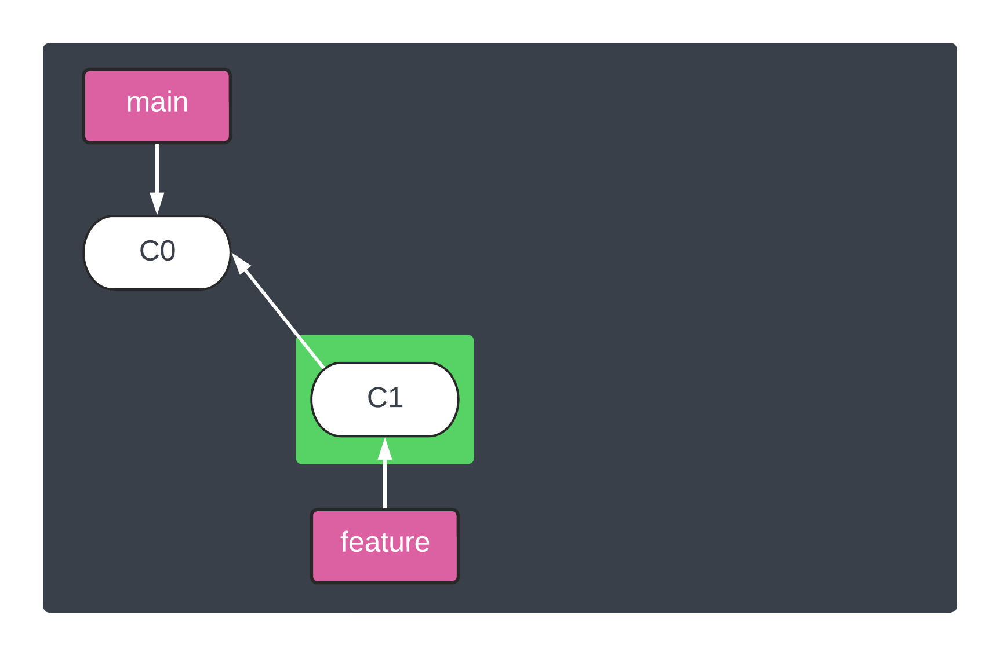
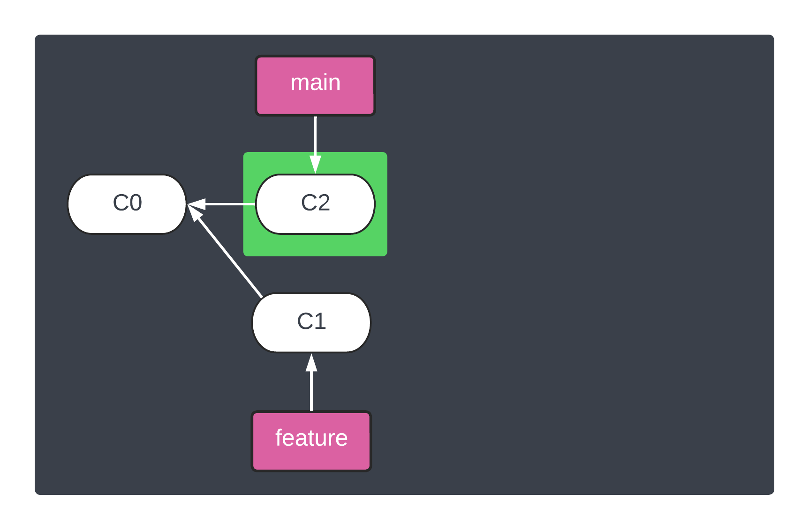
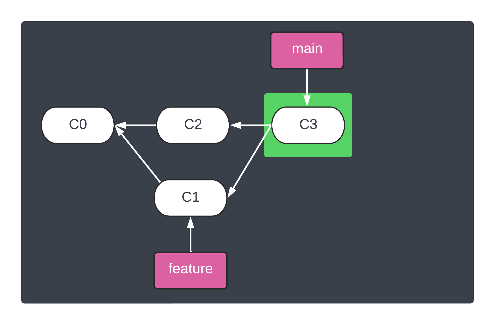
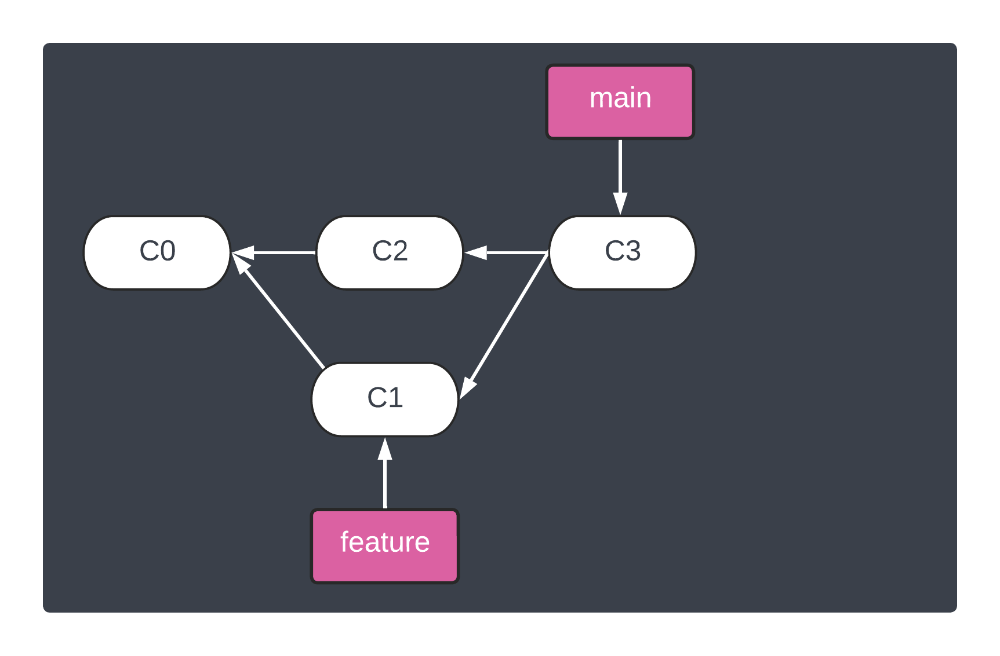

<h1 align="center">&#127890; Exercise: Signing and verifying merges</h1>

<p align="center">
  <a href="02-sign-verify-commits.md">Signing and verifying commits</a>
  Signing and verifying merges •  
  <a href="04-sign-verify-tags.md">Signing and verifying tags</a>
</p>

Signing merges from one branch into another is achieved via the [`--verify-signatures` flag][git-merge-verifysignatures] to `git merge`, which is important to understand how it works:

> Verify that the tip commit of the side branch being merged is signed with a valid key, i.e. a key that has a valid uid: in the default trust model, this means the signing key has been signed by a trusted key. If the tip commit of the side branch is not signed with a valid key, the merge is aborted.

This means that Git will only check that the tip or last commit of the branches are signed, not every commit.

## Outcomes

> In this exercise, the process for signing and verifying merges is covered including:
>
> 1. Explicitly sign and verify commits
> 1. Troubleshooting problems
> 1. Optional Git configurations to sign and verify all commits

## Steps

> **Note**
> This exercise uses preparation done previously in "[Signing and verifying commits](02-sign-verify-commits.md)".

1. **Create a branch where changes will be committed towards v1.0.0 release**

   ```shell
   git checkout -b feature/v1.0.0
   ```

1. **Create a simple "Hello world!" shell script**

   ```shell
   cat << 'EOF' > hello-world.sh
   #! /usr/bin/env bash

   echo "Hello world!"
   EOF

   chmod 755 hello-world.sh
   ./hello-world.sh
   ```

   resulting in:

   ```
   Hello world!
   ```

1. **Commit "Hello world!" shell script to feature branch**

   ```shell
   git add .
   git commit -m "Adding hello-world script for v1.0.0 release"
   ```

   

1. **Checkout the default branch to prepare for merging the feature branch**

   ```shell
   git checkout main
   ```

1. **Update the README prior to merging our changes for the new script**

   ```shell
   cat << 'EOF' >> README.md

   ## Hello world!

   The `v1.0.0` release contains the `hello-world.sh` script, which understandably displays `Hello world!`.
   EOF
   ```

1. **Commit updated README changes prior to merging our changes**

   ```shell
   git add .
   git commit -m "Expanding README for upcoming feature"
   ```

   

1. **Merge the feature branch, ensuring signatures are verified**

   ```shell
   git merge --verify-signatures feature/v1.0.0 -m "Merging in work towards v1.0.0 release"
   ```

   

   Possible results:

   - ```
     Commit 666e636 has a good GPG signature by andyfeller@github.com
     Merge made by the 'ort' strategy.
      hello-world.sh | 3 +++
      1 file changed, 3 insertions(+)
      create mode 100755 hello-world.sh
     ```

     :partying_face: Congratulations!  SSH merge signing is good.

   - ```
     fatal: Commit 666e636 does not have a GPG signature.
     ```

     :disappointed_relieved: Do not to worry!  This is error is likely due to the last commit not being signed or not trusted signer.

   For more information about signing merges, see "[`git merge --verify-signatures`][git-merge-verifysignatures]".

1. **Confirm logs show SSH commit sign status**

   ```shell
   git log
   ```

   Possible results:

   - ```
     commit 28c46b890121f042e86d7d1c1b58e150b8ac9948 (HEAD -> main)
     Good "git" signature for andyfeller@github.com with ED25519 key SHA256:kanlHE9MI77O18EdnFxgEnzc3v1rxJHlW475IbnHdG8
     Merge: ba5a622 666e636
     Author: Andy Feller <andyfeller@github.com>
     Date:   Sat Sep 10 19:55:34 2022 -0400
     
         Merging in work towards v1.0.0 release
     
     commit ba5a622501be61cc531c0732fd005c2dccb34944
     Good "git" signature for andyfeller@github.com with ED25519 key SHA256:kanlHE9MI77O18EdnFxgEnzc3v1rxJHlW475IbnHdG8
     Author: Andy Feller <andyfeller@github.com>
     Date:   Sat Sep 10 19:55:26 2022 -0400
     
         Expanding README for upcoming feature
     
     commit 666e6364fc8e3156e31de42b103dca58a0ff7a62 (feature/v1.0.0)
     Good "git" signature for andyfeller@github.com with ED25519 key SHA256:kanlHE9MI77O18EdnFxgEnzc3v1rxJHlW475IbnHdG8
     Author: Andy Feller <andyfeller@github.com>
     Date:   Sat Sep 10 19:53:01 2022 -0400
     
         Adding hello-world script for v1.0.0 release
     
     commit 14512033ae98ddb55eaebeedb27fdb78ae6cac49
     Good "git" signature for andyfeller@github.com with ED25519 key SHA256:kanlHE9MI77O18EdnFxgEnzc3v1rxJHlW475IbnHdG8
     Author: Andy Feller <andyfeller@github.com>
     Date:   Sat Sep 10 19:49:07 2022 -0400
     
         Initialize workspace repository README
     ```

     :partying_face: Congratulations!  SSH merge verification setup is good.

1. **Configure additional SSH merge signing and verifying for workshop repository specifically:**

   ```shell
   git config merge.verifySignatures true
   ```

   > **Note**
   > To globally configure SSH signing and verifying, use the `--global` flag:
   >
   > ```shell
   > git config --global merge.verifySignatures true
   > ```

   For more information about these Git configuration options, see [`merge.verifySignatures`][git-merge-verifysignatures].

## End of exercise

At the end of this exercise, the repository should look like:
  


<hr />
<p align="right">
  Next: <a href="04-sign-verify-tags.md">Signing and verifying tags</a>
</p>

[git-config-mergeverifysignatures]: https://git-scm.com/docs/git-config#Documentation/git-config.txt-mergeverifySignatures
[git-merge-verifysignatures]: https://git-scm.com/docs/git-merge#Documentation/git-merge.txt---verify-signatures
