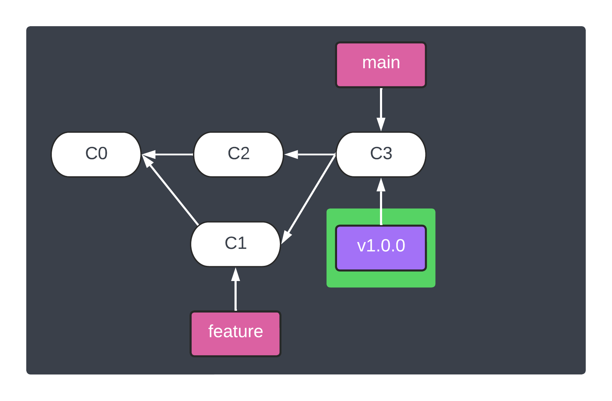
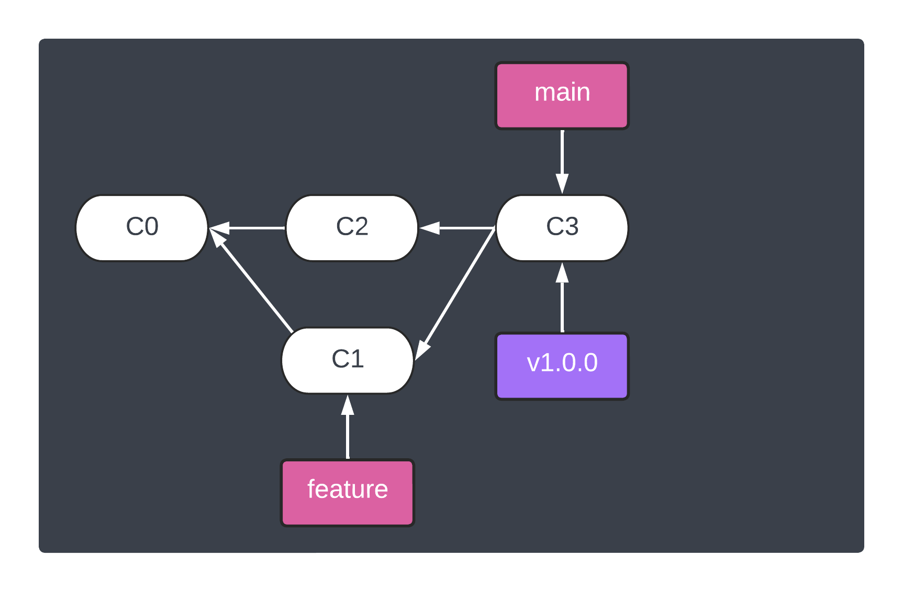

<h1 align="center">&#127890; Exercise: Signing and verifying tags</h1>

<p align="center">
  <a href="03-sign-verify-merges.md">Signing and verifying merges</a> •  
  Signing and verifying tags •  
  <a href="05-sign-past-commits-tags.md">Signing past commits and tags</a>
</p>

One aspect of signing tags that might be new for participants is the notion of [**lightweight** and **annotated** tags][git-tags]:

> A lightweight tag is very much like a branch that doesn’t change — it’s just a pointer to a specific commit.
>
> Annotated tags, however, are stored as full objects in the Git database. They’re checksummed; contain the tagger name, email, and date; have a tagging message; and can be signed and verified with GNU Privacy Guard (GPG). It’s generally recommended that you create annotated tags so you can have all this information; but if you want a temporary tag or for some reason don’t want to keep the other information, lightweight tags are available too.

## Outcomes

> In this exercise, the process for signing and verifying tags is covered including:
>
> 1. Explicitly sign and verify tags
> 1. Troubleshooting problems
> 1. Optional Git configurations to sign and verify all tags

## Steps

1. **Confirm SSH tag signing is setup correctly**

   ```shell
   git tag -s -m "Tagging v1.0.0 release" v1.0.0
   ```

   

   Possible responses:

   - ```
     error: cannot run gpg: No such file or directory
     error: gpg failed to sign the data
     error: unable to sign the tag
     The tag message has been left in .git/TAG_EDITMSG
     ```

     :disappointed_relieved: Do not to worry!  This is error is likely due to missing SSH signing configuration from "<a href="setup-workstation.md">Setup workstation</a>".

1. **Verify SSH tag is signed and trusted**

   ```shell
   git verify-tag -v v1.0.0
   ```

   Possible responses:

   - ```
     object 28c46b890121f042e86d7d1c1b58e150b8ac9948
     type commit
     tag v1.0.0
     tagger Andy Feller <andyfeller@github.com> 1662854258 -0400
     
     Tagging v1.0.0 release
     Good "git" signature for andyfeller@github.com with ED25519 key SHA256:kanlHE9MI77O18EdnFxgEnzc3v1rxJHlW475IbnHdG8
     ```

     :partying_face: Congratulations!  SSH tag verifying setup including SSH agent is good.

   - ```
     error: gpg.ssh.allowedSignersFile needs to be configured and exist for ssh signature verification
     ```

     :disappointed_relieved: Do not to worry!  This is error is likely due to missing SSH signing configuration from "<a href="setup-workstation.md">Setup workstation</a>".

1. **Configure additional SSH tag signing and verifying for workshop repository specifically:**

   ```shell
   git config tag.gpgsign true
   ```

   > **Note**
   > To globally configure SSH signing and verifying, use the `--global` flag:
   >
   > ```shell
   > git config --global tag.gpgsign true
   > ```

   For more information about these Git configuration options, see [`tag.gpgSign`][git-config-taggpgsign].

## End of exercise

At the end of this exercise, the repository should look like:



<hr />
<p align="right">
  Next: <a href="05-sign-past-commits-tags.md">Signing past commits and tags</a>
</p>

[git-config-taggpgsign]: https://git-scm.com/docs/git-config#Documentation/git-config.txt-taggpgSign
[git-tags]: https://git-scm.com/book/en/v2/Git-Basics-Tagging#_creating_tags
[git-verify-tag]: https://git-scm.com/docs/git-verify-tag