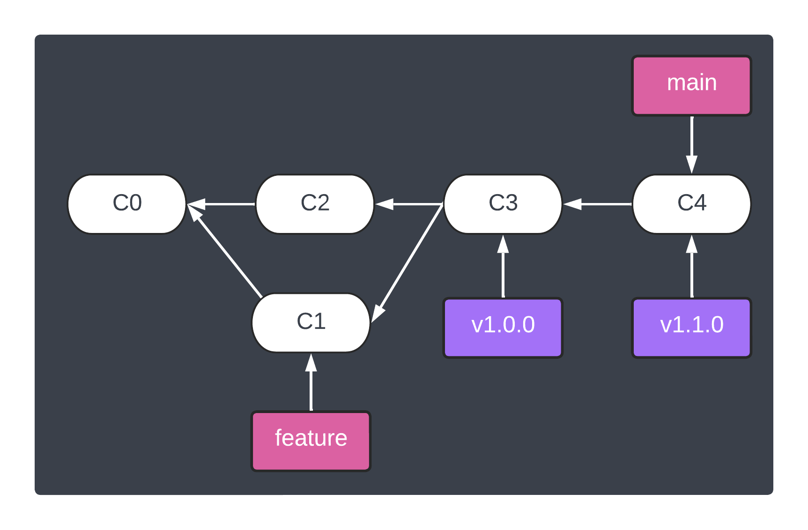

<h1 align="center">&#127890; Exercise: Signing past commits and tags</h1>

<p align="center">
  <a href="04-sign-verify-tags.md">Signing and verifying tags</a> •  
  Signing past commits and tags •  
  <a href="/README.md#rocket-beyond">&#128640; Beyond</a>
</p>

When considering signing code, the [Pro Git book section on signing][git-signing-everyone] reinforces the idea that it is something everyone involved must do:

> Signing tags and commits is great, but if you decide to use this in your normal workflow, you’ll have to make sure that everyone on your team understands how to do so. If you don’t, you’ll end up spending a lot of time helping people figure out how to rewrite their commits with signed versions. Make sure you understand GPG and the benefits of signing things before adopting this as part of your standard workflow.

This section is intended to help participants gain familiarity for the situation where someone new or accidentally does not sign commits and tags.

## Outcomes

> In this exercise, the process for signing older commits and tags is covered.

## Steps

1. **Create a simple "foo bar" script**

   ```shell
   cat << 'EOF' > foo.sh
   #! /usr/bin/env bash

   echo "bar"
   EOF

   cat << 'EOF' >> README.md

   ## Foo bar

   Since the `v1.0.0` release, the `foo.sh` script was added, which understandably displays `bar`.
   EOF

   chmod 755 foo.sh
   ./foo.sh
   ```

   resulting in:

   ```
   bar
   ```

1. **Commit "bar" script without signing the commit**

   ```shell
   git add .
   git commit --no-gpg-sign -m "Adding foo script without signing"
   git log
   ```

   should result in something like:

   ```shell
   commit af43f7efe80503b3ebde54c7db85a54e50e3b2d3 (HEAD -> main)
   Author: Andy Feller <andyfeller@github.com>
   Date:   Sat Sep 10 20:05:52 2022 -0400
   
       Adding foo script without signing
   ```

1. **Amend last commit, verifying it is signed**

   ```shell
   git commit --amend --no-edit -S
   git verify-commit -v HEAD
   ```

   should result in something like:

   ```shell
   tree d962e454f8269b75d32c8dfc7ac64b301f6af3ae
   parent 28c46b890121f042e86d7d1c1b58e150b8ac9948
   author Andy Feller <andyfeller@github.com> 1662854752 -0400
   committer Andy Feller <andyfeller@github.com> 1662854795 -0400
   
   Adding foo script without signing
   Good "git" signature for andyfeller@github.com with ED25519 key SHA256:kanlHE9MI77O18EdnFxgEnzc3v1rxJHlW475IbnHdG8
   ```

   > **Note**
   > For signing multiple commits in a branch,
   >
   > ```shell
   > git rebase --exec 'git commit --amend --no-edit -n -S' -i <BRANCH>
   > ```


1. **Create new tag, verifying it is unsigned**

   ```shell
   git tag --no-sign -m "Setup for signing old tags" v1.1.0
   git tag -v v1.1.0
   ```

   should result in something like:

   ```shell
   object 73f57f8ca11bb77cc14a8a0465e2f98b9f76a652
   type commit
   tag v1.1.0
   tagger Andy Feller <andyfeller@github.com> 1662854957 -0400
   
   Setup for signing old tags
   error: no signature found
   ```

1. **Retag last tag, verifying it is signed**

   ```shell
   git tag v1.1.0 v1.1.0 -f -s
   git tag -v v1.1.0
   ```

   should result in something like:

   ```shell
   Updated tag 'v1.1.0' (was d12ff7f)
   object d12ff7f288aae53d3d08e710ca95be5cde8fcc4d
   type tag
   tag v1.1.0
   tagger Andy Feller <andyfeller@github.com> 1662854999 -0400
   
   Setup for signing old tags
   Good "git" signature for andyfeller@github.com with ED25519 key SHA256:kanlHE9MI77O18EdnFxgEnzc3v1rxJHlW475IbnHdG8
   ```

## End of exercise

At the end of this exercise, the repository should look like:



<hr />
<p align="right">
  Next: <a href="/README.md#rocket-beyond">&#128640; Beyond</a>
</p>

[git-signing-everyone]: https://git-scm.com/book/en/v2/Git-Tools-Signing-Your-Work#_everyone_must_sign